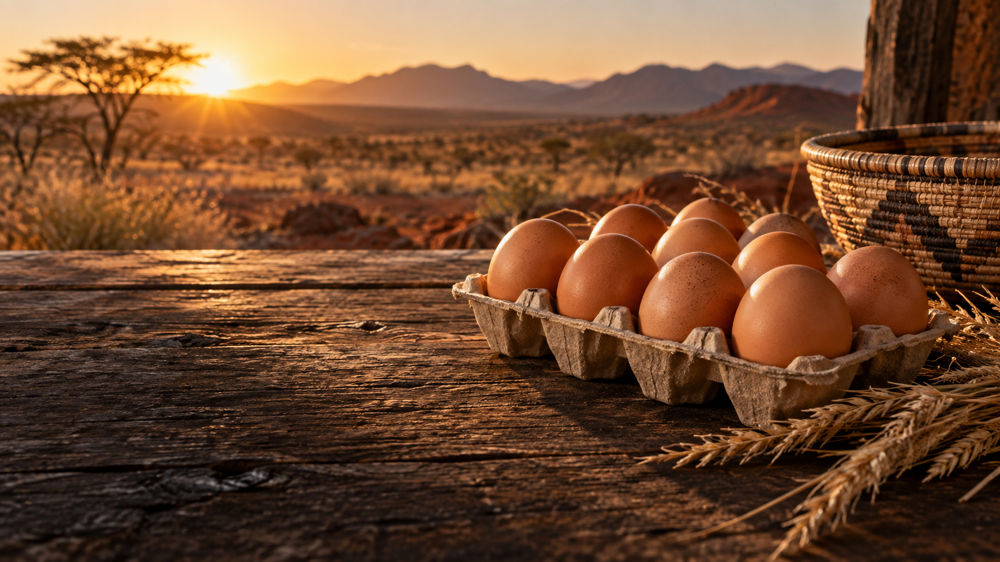
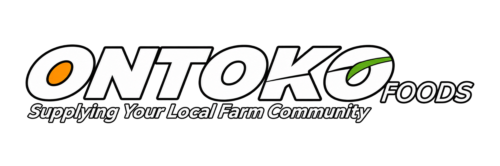
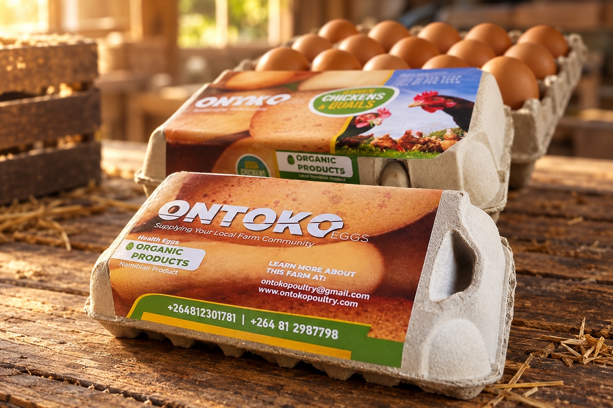
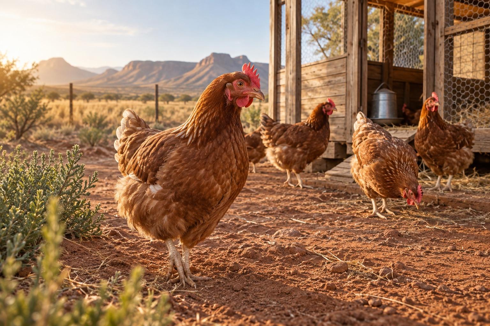
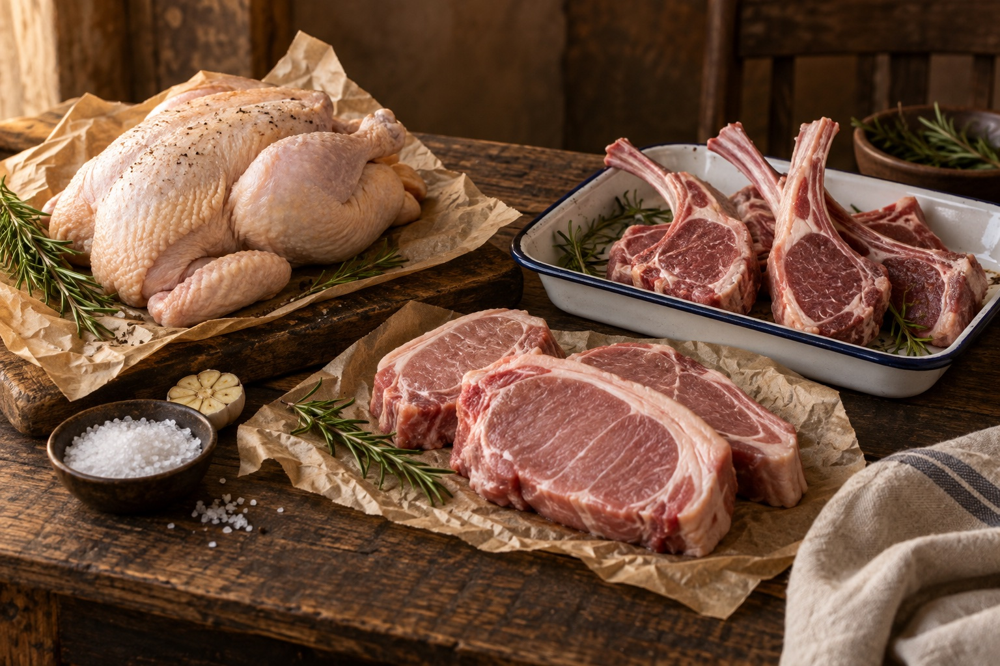
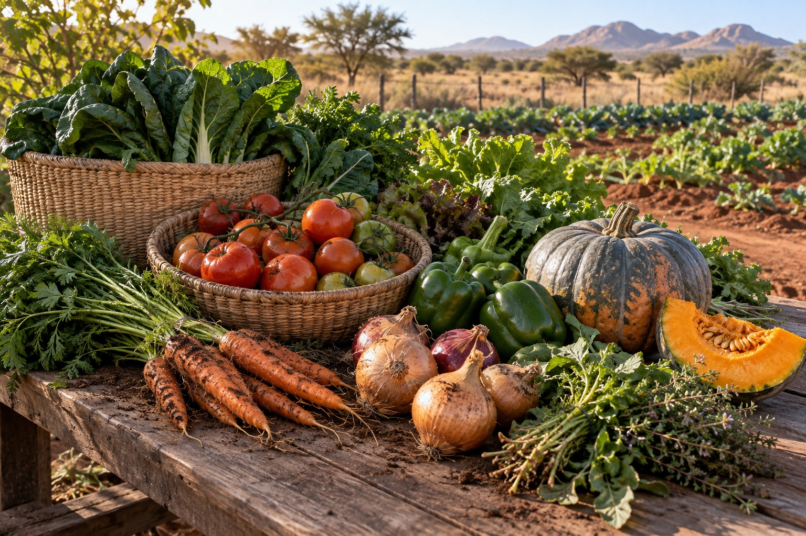
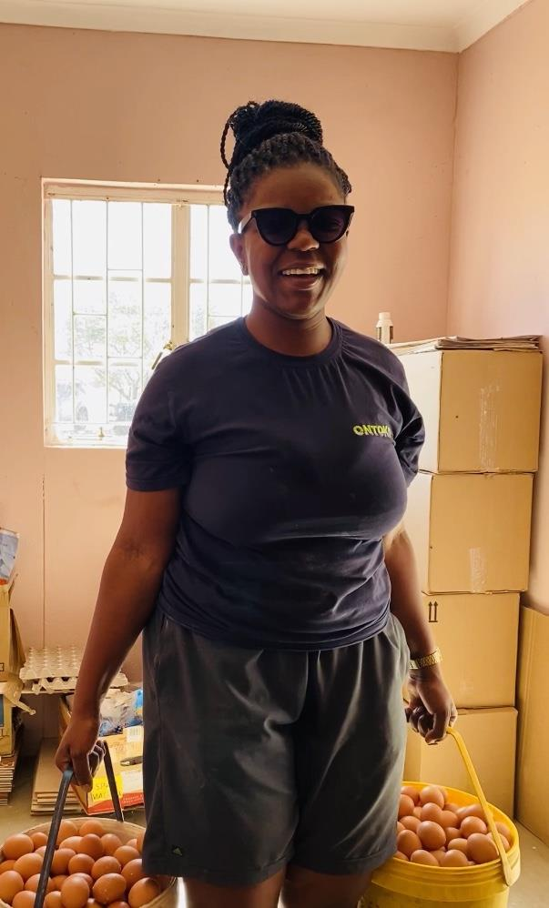
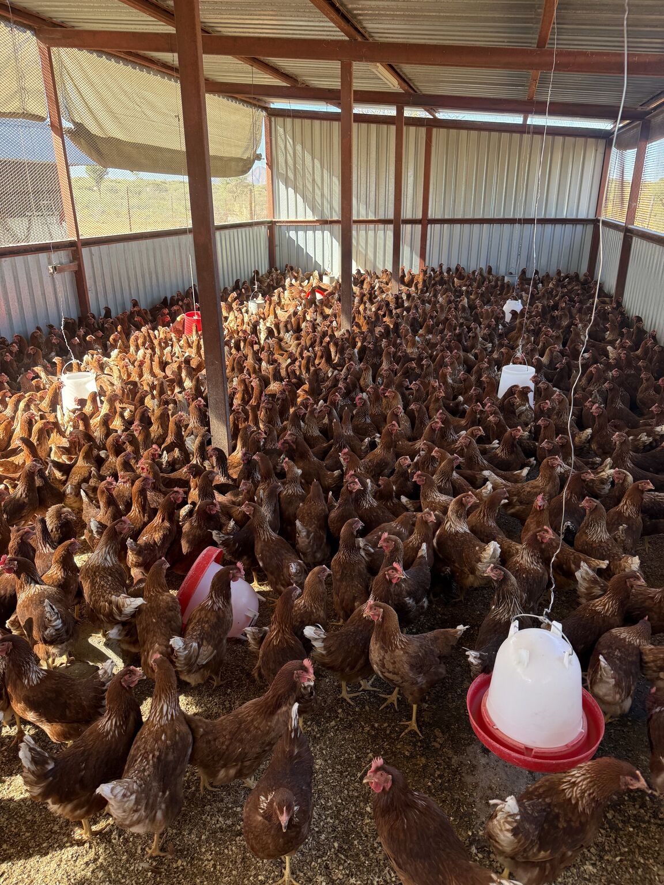

  

  

# Ontoko Foods — Feeding Home

**[Visit the live website](https://ontoko-foods.pages.dev/)**

Ontoko Foods is a woman-led Namibian agricultural business built by Jane Auala and her family near Groot Aub. From a small household poultry operation, Ontoko has grown into a local food producer supplying eggs, poultry, meat and seasonal produce while contributing to food security, farmer knowledge and women's leadership in agriculture.

This project gives that journey the digital presence it deserves: unmistakably Ontoko, grounded in real evidence and ambitious enough to match the business Jane built brick by brick.

## The brief

Ontoko had a recognisable product identity, public coverage and a strong founder story, but no owned digital home connecting them. The website needed to feel like a natural extension of the cartons, farm and social presence—not a generic agriculture template. It also needed to speak equally well to households, retailers, wholesale partners and future collaborators.

## What shipped

- A premium, mobile-first website shaped around Ontoko's existing identity
- A faithful digital adaptation of the Ontoko logo and packaging language
- Clear presentation of eggs, poultry, farm meats and seasonal produce
- A founder-led story tracing Jane Auala's journey from family farm to growing enterprise
- A source-grounded timeline from the farm's beginnings to the 2026 flock expansion
- Authentic Ontoko archive photography and carefully art-directed supporting imagery
- An interactive then-to-now reveal that makes the growth tangible
- Embedded audio so visitors can hear Jane describe the journey in her own voice
- Direct WhatsApp and email conversion paths for customers and partners
- Accessible motion, reduced-motion support, responsive layouts and Cloudflare security headers

## From product list to product appetite

The range originally risked reading like four coloured information panels. The final system treats every category as something visitors should be able to see and almost feel: authentic Ontoko cartons, healthy poultry, tactile farm meats and an abundant seasonal harvest. The four photographs share one warm Namibian light, one earthy grade and one editorial standard, while the interface preserves strong text contrast and natural mobile crops.

<table>
  <tr>
    <td width="50%"></td>
    <td width="50%"></td>
  </tr>
  <tr>
    <td width="50%"></td>
    <td width="50%"></td>
  </tr>
</table>

Flat colour fields across the wider site were rebuilt with paper grain, agricultural contour lines, photographic depth, warm light and oversized background typography. Mobile is not a compressed desktop afterthought: crops, type scales, tap targets, safe areas and interaction states are deliberately tuned down to 320px.

## Design direction

The visual system starts with the brand already on Ontoko's cartons: yolk orange, farm green, warm cream, earth brown and a bold black ground. **Fraunces** brings a human, editorial voice to Jane's story; **Manrope** keeps product and action language clean and contemporary.

Large type, harvest-scale photography and tactile bento cards give the business confidence. Rounded details and warm copy keep it generous. The opening logo sequence feels less like a generic spinner and more like Ontoko itself arriving on screen.

The guiding line became:

> Food made to feed home.

## Founder story as product architecture

Jane's story is not an appendix. It is the emotional spine of the experience. The site moves from produce to purpose, then from personal determination to visible business growth. That structure helps visitors understand that buying from Ontoko supports a local food system, a family enterprise and a woman creating opportunity through agriculture.

<table>
  <tr>
    <td width="42%" valign="top"></td>
    <td width="58%" valign="top"></td>
  </tr>
</table>

## Authenticity by design

The research layer brought together Ontoko's public archive, founder posts, Namibian media coverage, programme recognition and Jane's own recorded interview. Facts on the site were written from traceable sources, while real Ontoko imagery anchors the visual story.

That grounding matters. The aim was never to make Ontoko look like somebody else's idea of a premium farm—it was to reveal the quality, grit and momentum already there.

## Product boundary

This repository is a public case study. Production source, original high-resolution media, contact workflows, deployment configuration and private working files remain in a separate private repository. Brand and photographic assets shown here belong to their respective owners and are not licensed for reuse.

## Role

Public-source research · story architecture · brand translation · art direction · UX/UI · responsive frontend engineering · interaction design · accessibility · performance · Cloudflare deployment

## Links

- [Ontoko Foods — live website](https://ontoko-foods.pages.dev/)
- [Freeman Ipumbu portfolio](https://freeman-ipumbu.pages.dev/)
- [Jane Auala's Ontoko expansion story](https://www.linkedin.com/posts/janeauala_ontokotradingenterprises-foodsecurity-activity-7471433776577957888-1ZFS)
- [Ontoko Foods coverage by My Zone / Namibia Media Holdings](https://zone.my.na/news/ontoko-eggs-on-the-rise2020-09-08)

---

An experience by **[SolarSpin Technologies](https://freeman-ipumbu.pages.dev/)**. Built by Freeman Ipumbu for Jane, Ontoko and the food future Namibia can grow at home.
